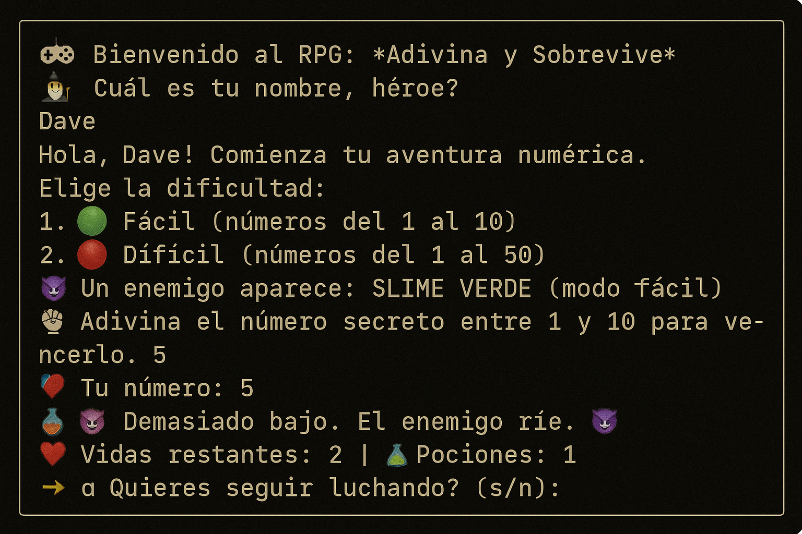

# 🎮 RPG: Guess and Survive

Welcome to a mini console-based RPG where your mission is to guess the secret number to defeat epic enemies! ⚔️🧠  
The game features background music, a health system, healing potions, and autosave.



---

## 🧙 Features

- Random enemies each round
- Easy and hard difficulty modes
- Healing potions for survival
- Optional epic background music
- Game auto-saves to text files

---

## ▶️ How to Play

### 1. Install Python (if you don’t have it)
Download Python from [https://www.python.org](https://www.python.org)

### 2. Install dependencies
You'll only need `pygame` for the music:
```bash
pip install pygame
